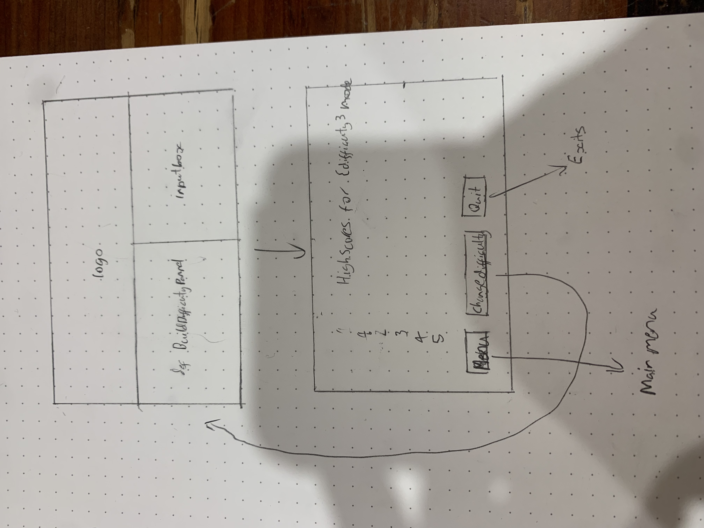
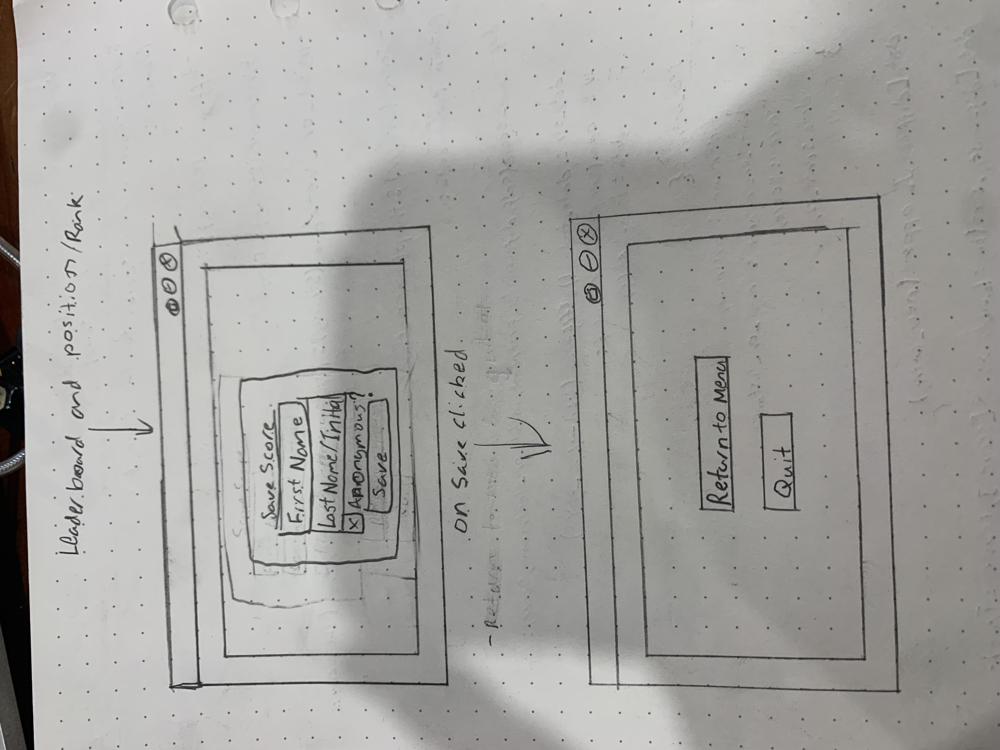
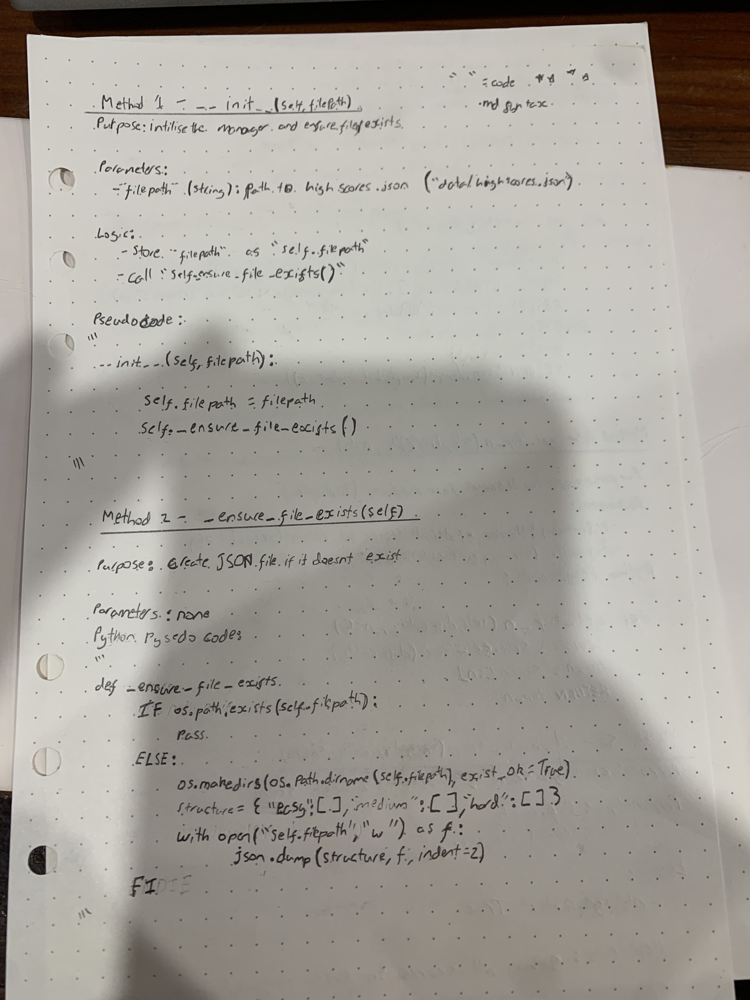
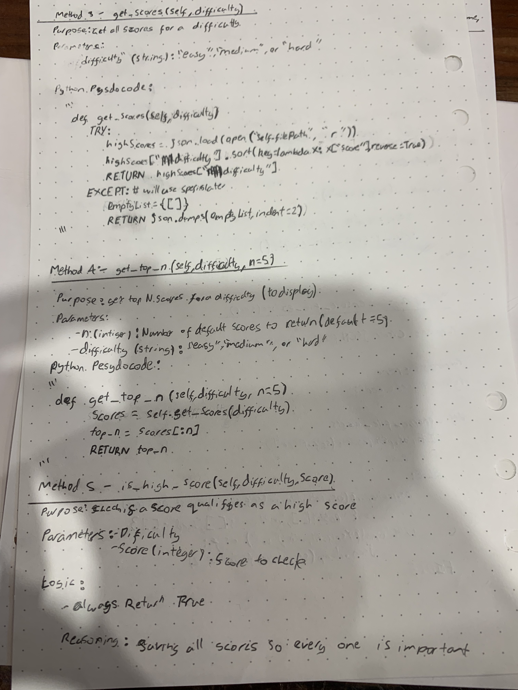
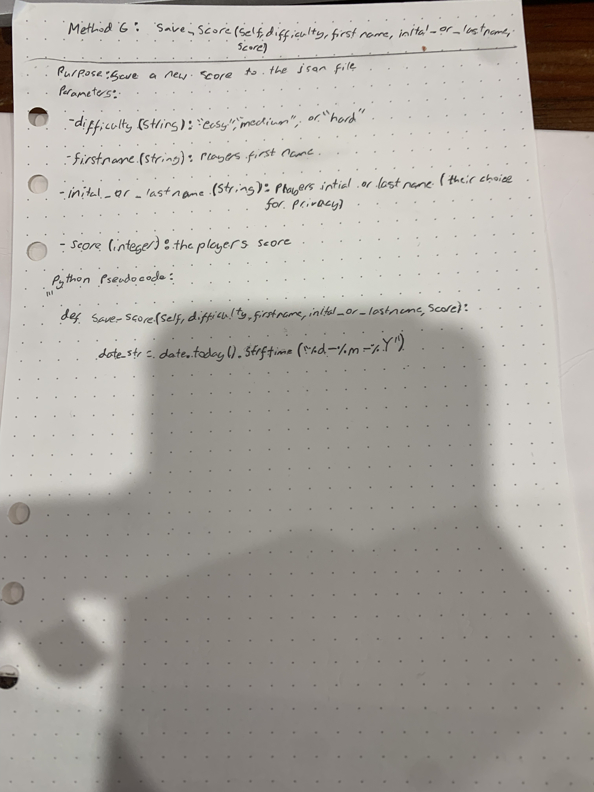

# Screen Designs and Algorithms

Here are some photos of the early screen designs as well as photos of me working through some theorised algorithms.

  
  

  
  

  

---

Additional digital versions of some of the UX designs were made but were lost when my SSD failed.
