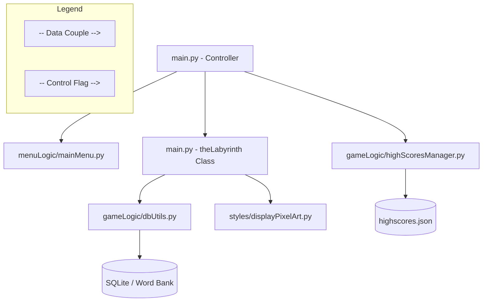

```mermaid
graph TD
    %% Main Entry Point
    Main[main.py - Controller] 

    %% Level 1: Core Systems
    Main --> UI[menuLogic/mainMenu.py]
    Main --> Game[main.py - theLabyrinth Class]
    Main --> HS[gameLogic/highScoresManager.py]

    %% Level 2: Game Sub-systems
    Game --> DB[gameLogic/dbUtils.py]
    Game --> Display[styles/displayPixelArt.py]
    
    %% Level 3: Database & External
    DB --> SQLite[(SQLite / Word Bank)]
    HS --> JSON[(highscores.json)]

    %% Example of Data Flow (Couples)
    %% In a real structure chart, you'd label these arrows
    subgraph Legend
        direction LR
        DataArrow[-- Data Couple -->]
        ControlArrow[-- Control Flag -->]
    end
```

